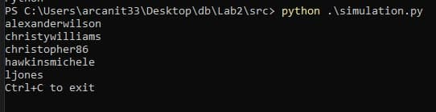
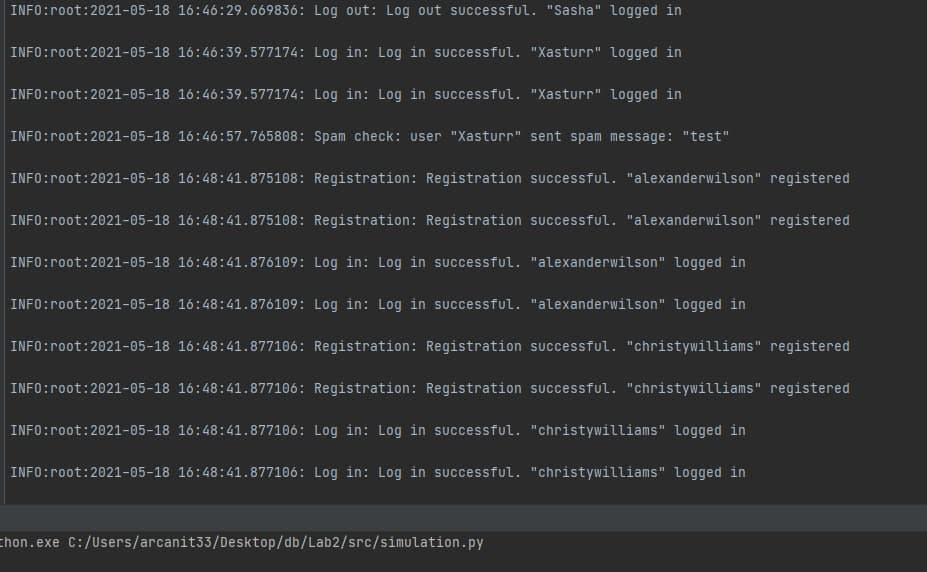

# Лабораторна робота No 2. Практика використання серверу Redis
### Метою роботи є здобуття практичних навичок створення ефективних програм, орієнтованих на використання сервера Redis за допомогою мови Python.

### Завдання​ на роботу полягає у наступному: реалізувати можливості обміну повідомленнями між користувачами у оффлайнта онлайн режамах із можливістю фільтрації спам-повідомлень.

## Виконав: Нікітін Олександр Олександрович, КП-81

## Завдання 

[Лабораторна робота № 2](https://docs.google.com/document/u/0/d/1ymkaZA5xorduipavVCKliBGvg-ZYH5rm1Pyfwuu6AUM/edit?usp=drive_web)

## Обгрунтування вибору сруктур даних:

Повідомлення зберігаються в хештаблиці, оскільки вона зберігає дані в парі ключ - значення. Це дозволє легко отримувати та обробляти повідомлення які відправили користувачі.
В якості ключа виступає message_id, а в якості значення структура, яка зберігає такі дані як текст, id відправника, id отримувача та статус повідомлення.

Користувачі зберігаються в множині, оскільки нам важлива швидкість.

Для черги повідомлень використувоється List, так як нам є важливий порядок додавання та вилучення повідомлень. Також слід зауважити що в такому випадку час додавання та вилучення становитимме О(1).

## Приклади роботи програми

Приклад взаємодії з головним меню (user.py)

Приклад взаємодії з меню користувача (user.py)

Приклад взаємодії з меню адміністратора (admin.py)

Приклад роботи обробника повідомлень (worker.py)

Приклад роботи симуляції (admin.py)

Приклад збережених логів (events.log)

