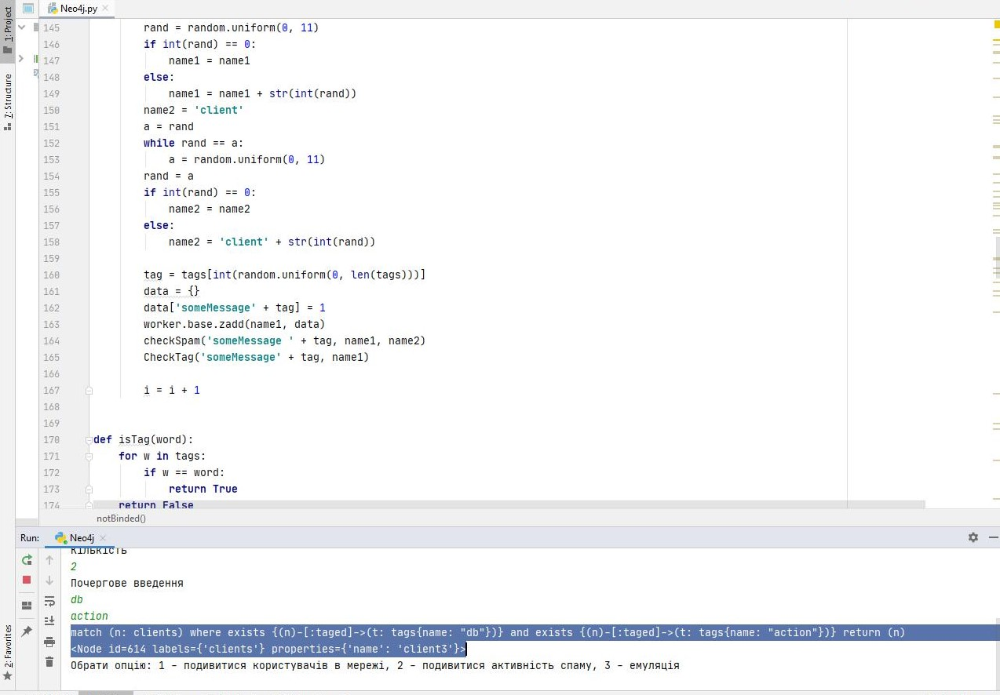
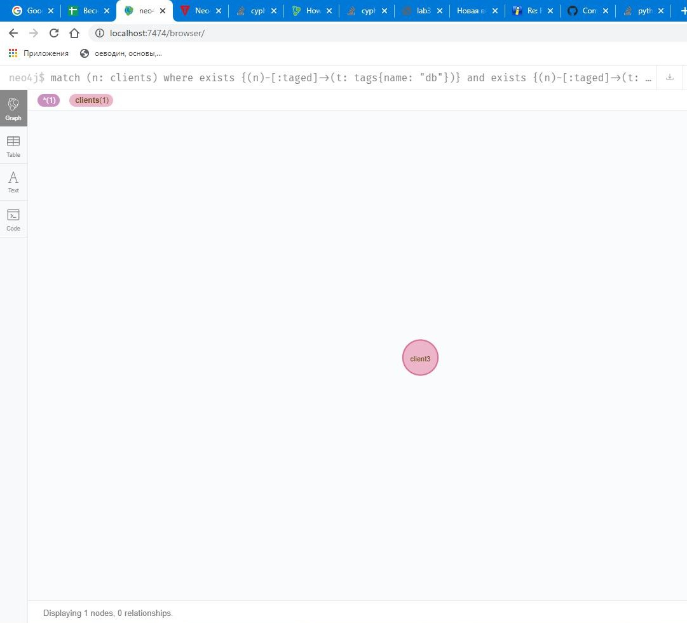
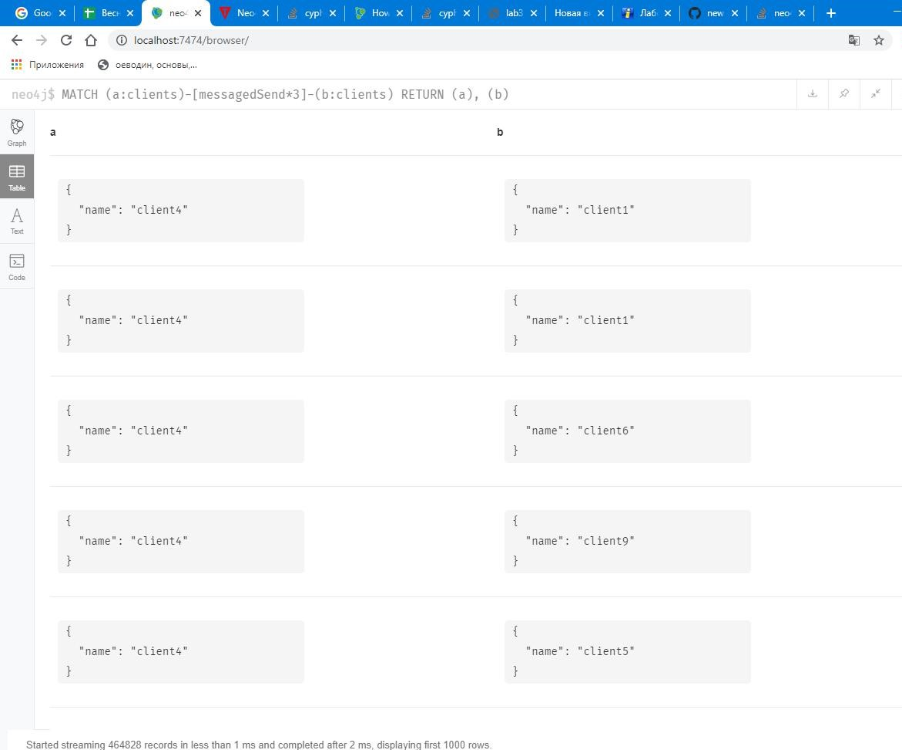
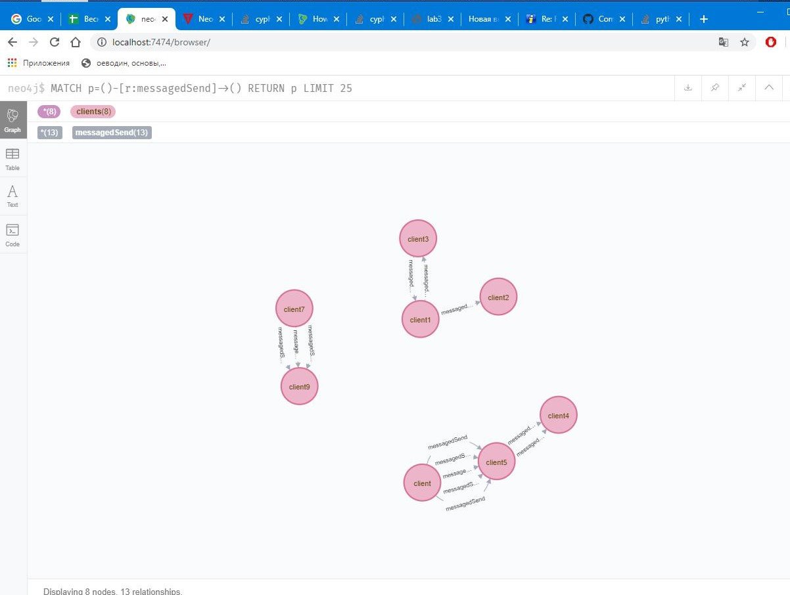
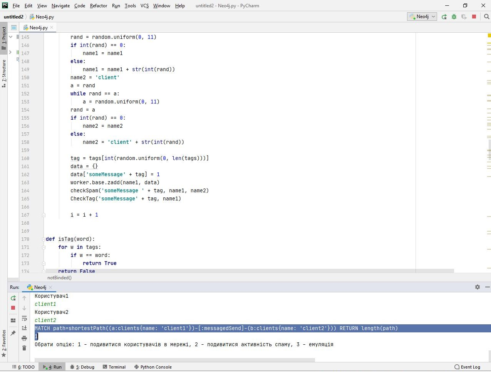
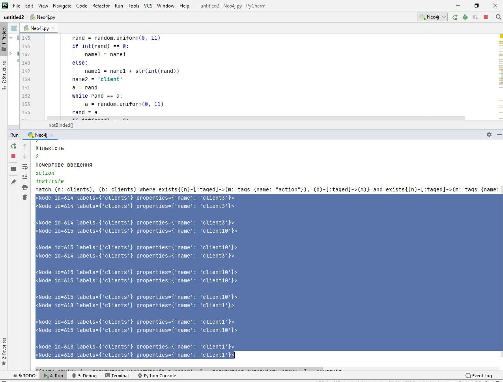
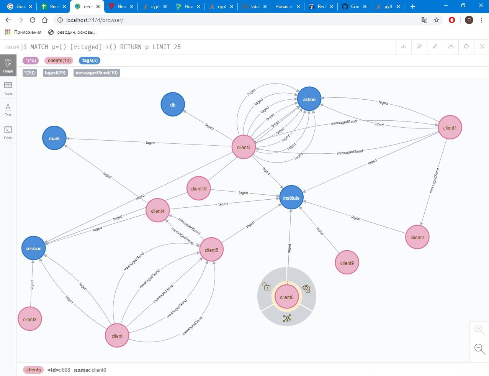
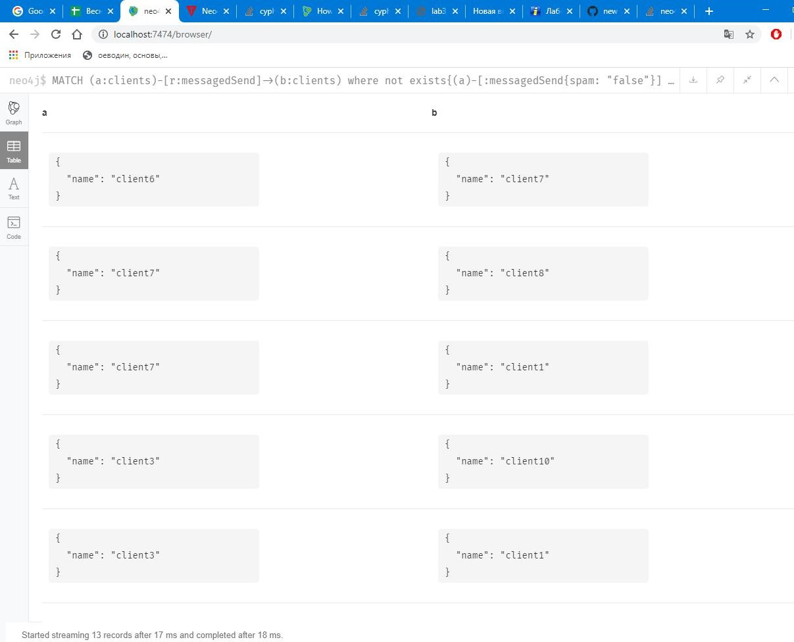
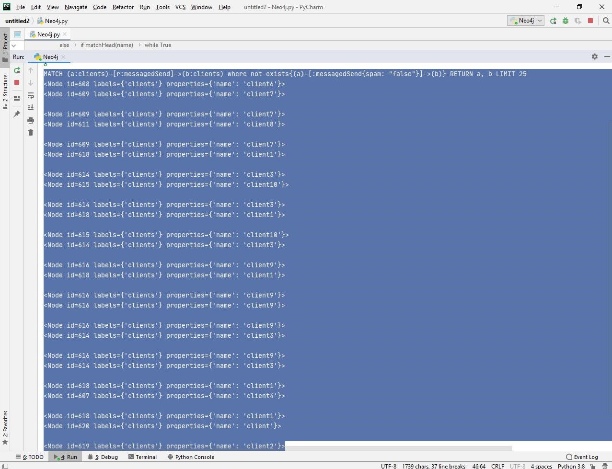

# Лабораторна робота No 3. Практика створення програм, орієнтованих на використання графової бази даних Neo4J за допомогою мови Python.

### Завдання​ на роботу полягає у наступному: Реалізувати можливості формування графової бази даних в онлайн-режимі на основі модифікованої програми лабораторної роботи №2. На основі побудованої графової бази даних виконати аналіз сформованих даних.

## Виконав: Нікітін Олександр Олександрович, КП-81

## Завдання 

[Лабораторна робота № 3](https://docs.google.com/document/d/1LjkTBjq4TOmAHlicYj2q5pm11Ats1Xz6d1gkS84QgZE/edit)

## Приклади роботи програми

6.1. Задано список тегів (tags). Знайти всіх користувачів, що відправили або отримали повідомлення з набором тегів tags.
tags = [“db”, “action”]
match (n: clients) where exists {(n)-[:taged]->(t: tags{name: "action"})} and exists {(n)-[:taged]->(t: tags{name: "db"})} return (n)

6.2. Задано довжину зв’язку N - кількість спільних повідомлень між користувачами. Знайти усі пари користувачів, що мають зв’язок довжиною N через відправлені або отримані повідомлення.
n = 3
MATCH (a:clients)-[messagedSend*3]-(b:clients)  RETURN (a), (b)

6.3. Задано два користувача. Знайти на графі найкоротший шлях між ними через відправлені або отримані повідомлення.
Користувачі - client1, client2
MATCH path=shortestPath((a:clients{name: 'client1'})-[:messagedSend]-(b:clients{name: 'client2'})) RETURN length(path)

6.5. Задано список тегів (tags). Знайти всіх користувачів, що відправили або отримали повідомлення з набором тегів tags, але ці користувачі не пов’язані між собою.
tags = [“action”, “institute”]
match (n: clients), (b: clients) where exists{(n)-[:taged]->(m: tags {name: "action"}), (b)-[:taged]->(m)} and exists{(n)-[:taged]->(m: tags {name: "institute"}), (b)-[:taged]->(m)} and not exists {(n)-[:messagedSend]-(b)} return (n), (b)

6.4. Знайти авторів повідомлень, які пов’язані між собою лише повідомленнями, позначеними як “спам”.
MATCH (a:clients)-[r:messagedSend]->(b:clients) where not exists{(a)-[:messagedSend{spam: "false"}]->(b)} RETURN a, b

